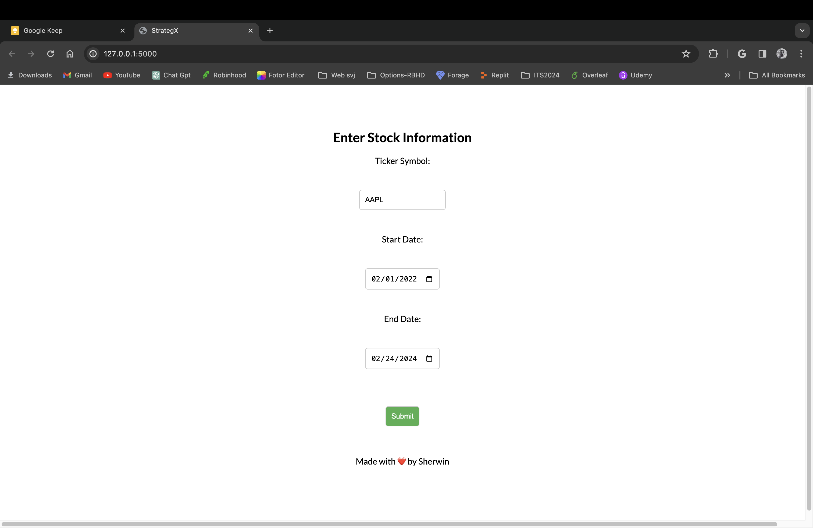
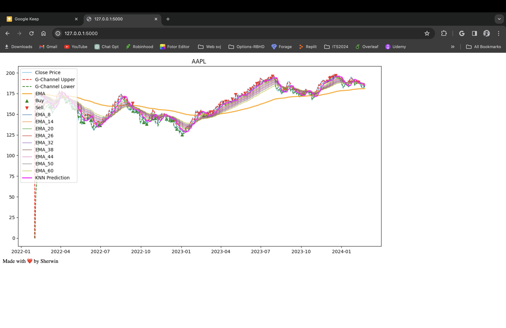

# StrategX

StrategX is a Flask-based web application designed to demonstrate stock analysis using various technical indicators, including G-Channel, EMA, ATR SL/TP, and a KNN-based indicator. It allows users to input a stock ticker and a date range to visualize the stock's performance and potential trading signals.

## Features

- Fetch stock data using `yfinance`.
- Calculate and visualize G-Channel, EMA (Exponential Moving Average), and ATR (Average True Range) Stop Loss/Take Profit indicators.
- Implement a KNN (K-Nearest Neighbors) based indicator for stock price prediction.
- User-friendly web interface for inputting stock ticker and date range.
- Professional styling with CSS and integration of the Lato font for better user experience.

## Indicators Used

- **G-Channel**: A custom indicator that uses the maximum and minimum of close prices over a specified period to plot upper and lower bounds. It's useful for identifying potential breakout points.
- **EMA (Exponential Moving Average)**: A type of moving average that places a greater weight and significance on the most recent data points. It's commonly used to identify the trend direction.
- **ATR SL/TP (Average True Range Stop Loss/Take Profit)**: Utilizes the ATR indicator to determine optimal stop loss and take profit levels based on market volatility.
- **KNN (K-Nearest Neighbors) Based Indicator**: A machine learning approach used here to predict future stock prices based on the analysis of historical price data. It identifies patterns by looking at the 'K' most similar instances (neighbors) and averaging their values for the prediction.


## Installation

To run StrategX on your local machine, you need Python 3.6+ installed. Follow these steps:

1. Clone this repository to your local machine.
    ```bash
    git clone https://github.com/sherwinvishesh/StrategX.git
    ```
2. Navigate to the project directory.
    ```bash
    cd StrategX
    ```
3. Install the required Python packages.
    ```bash
    pip3 install pandas numpy matplotlib yfinance flask
    ```
4. Run the Flask application.
    ```bash
    python3 app.py
    ```


## User Interface




## Usage

After starting the Flask application, navigate to `http://127.0.0.1:5000/` in your web browser. 

1. Enter the stock ticker symbol (e.g., AAPL for Apple Inc.).
2. Select the start and end dates for the analysis.
3. Click `Submit` to view the stock analysis and trading signals based on the selected indicators.

## Technologies

- Flask: A lightweight WSGI web application framework.
- Pandas & NumPy: For data manipulation and analysis.
- Matplotlib: For creating static, interactive, and animated visualizations in Python.
- yfinance: Yahoo Finance market data downloader.

## Contributing

Contributions to enhance this project are welcomed. Please feel free to fork the repository, make changes, and submit pull requests.

## Support

If you encounter any issues or have any questions, please submit an issue on the GitHub issue tracker or feel free to contact me.


## License

StrategX is open source and available under the [MIT License](LICENSE).

## Acknowledgments


- Thanks to everyone who visits and uses this page. Your interest and feedback are what keep us motivated.
- Special thanks to all the contributors who help maintain and improve this project. Your dedication and hard work are greatly appreciated.
## Connect with Me

Feel free to reach out and connect with me on [LinkedIn](https://www.linkedin.com/in/sherwinvishesh) or [Instagram](https://www.instagram.com/sherwinvishesh/).

---

Made with ❤️ by Sherwin
